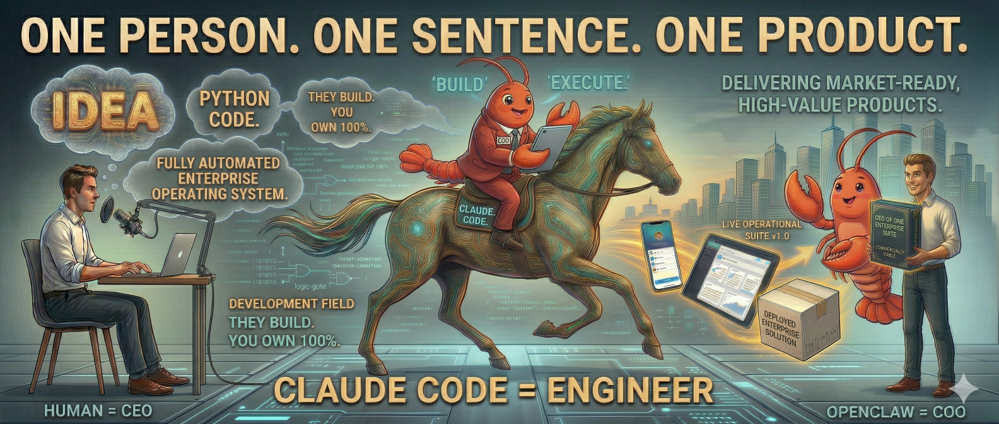

<p align="left">
  <a href="README.md"></a>
</p>

<p align="center">
  <h1 align="center">CEO of One</h1>
  <p align="center"><em>不写代码，做出真正的产品。12 章实战验证。</em></p>
</p>

<p align="center">
  
  
  
  
  
</p>

<p align="center">
  
</p>

---

> **一个人。一句话。一个产品。**
>
> 2026 年，你不需要团队，不需要学编程，不需要融资。
> OpenClaw 当你的 COO，Claude Code 当你的工程师。
> **你说一句话，他们把产品做出来，你拥有 100% 的股权。**

这本开源书教你这套方法——产品已经做出来了，在线可体验。

## 怎么运作

你扮演 **CEO**。你不需要写代码——你只需要说话。

```
你（CEO）→ "帮我做一个课程平台"
                   ↓
OpenClaw（COO）→ 理解意图、拆解任务、分配工作、验收质量
                   ↓
Claude Code（工程师）→ 写代码、跑测试、改 bug、上线
                   ↓
你（CEO）← "做好了，你看看效果"
```

**OpenClaw** 是一个开源 AI Agent 平台，充当你的 COO——它管理你的 AI 编程代理，在会话间保持上下文，并强制执行质量标准。把它想象成你的单人公司的操作系统。[了解更多 →](https://github.com/openclaw/openclaw)

**Claude Code** 是 Anthropic 的 AI 编程代理。它根据自然语言指令编写、测试和部署代码。你不需要理解它写的代码。[了解更多 →](https://docs.anthropic.com/en/docs/claude-code)

## 你将做出什么

一个真实的、能赚钱的知识付费平台——**"CEO of One 训练营"**——从一句话到上线收费。

| 章 | 你将做出这个 |
|---|------------|
| 🚀 [0-setup](chapters/00-setup/) | 5 分钟，你的 AI 团队就位 |
| 🧠 [1-soul](chapters/01-soul/) | 像老板一样跟 AI 说话 — 为什么一句说对的话胜过 1000 行代码 |
| 🎯 [2-snake-game](chapters/02-snake-game/) | 贪吃蛇实战 — 你的第一个产品 |
| 📝 [3-quality-checklist](chapters/03-quality-checklist/) | 验收清单 — 让 AI 一次性做对 |
| 🏠 [4-landing-page](chapters/04-landing-page/) | 训练营首页 — 你正在看的这个网站 |
| 🌐 [5-going-global](chapters/05-going-global/) | 走向全球 — 让你的产品支持双语 (i18n) |
| 🔐 [6-auth](chapters/06-auth/) | 注册登录 — 让用户留下来 |
| 💳 [7-payment](chapters/07-payment/) | 支付功能 — 开始赚钱 |
| 🐛 [8-bugfix](chapters/08-bugfix/) | Bug 修复实战 — 真实产品必有 bug |
| 🌍 [9-deploy](chapters/09-deploy/) | 部署上线 — 让全世界看到 |
| 📊 [10-dashboard](chapters/10-dashboard/) | 数据看板 — 你的业务仪表盘 |
| 🎓 [11-graduation](chapters/11-graduation/) | 毕业项目 — 不看教程，从零做出第二个产品 |
| 🔄 [12-product-flywheel](chapters/12-product-flywheel/) | 产品飞轮 — 你的产品自己修 bug — 全自动 |

## 为什么不一样

- 🗣️ **全程不需要写代码**，你只需要说话
- 🧪 **每句话术都经过实战验证**，先做出来，再写进书里
- 🏗️ **一个产品从头到尾**，不是碎片教程，是完整的产品之旅
- 💰 **第 6 章就能收钱**，你的产品具备付费能力

> ⚠️ **重要提示：** 本课程中的支付系统使用的是**模拟支付**（不涉及真实金额）。接入真实支付（Stripe、微信支付等）是毕业后的事。架构已经为真实支付做好准备——到时候替换一个模块就行。

- 🎓 **自证效应**：这本书本身就是用它教的方法做出来的

> ⚠️ **重要提示：** 平台使用的是**内存种子数据**（不是数据库）。用户、课程、订单在服务器重启后会重置。添加数据库（PostgreSQL、MongoDB 等）是毕业后的事。架构已经为数据库做好准备——到时候把 `store.ts` 替换成真实数据库模块就行。

## 快速开始

**完成全部课程的总成本：约 $5-15（Claude API 用量），无需订阅。**

1. **克隆本仓库：**
   ```bash
   git clone https://github.com/AIwork4me/ceo-of-one.git
   cd ceo-of-one
   ```
2. 👉 跟着[第 0 章：5 分钟让 AI 听你的话](chapters/00-setup/)走——每一步安装都有详细说明。

> **赶时间？** 极简版：
> ```bash
> npm install -g openclaw acpx @anthropic-ai/claude-code   # 安装工具
> export ANTHROPIC_API_KEY=你的key                            # 设置 API key
> openclaw gateway start                                     # 启动你的 COO
> cp templates/SOUL-COO.md ~/.openclaw/workspace/SOUL.md     # 加载 COO 大脑
> ```
> 但真的——先读第 0 章。它解释了**为什么**每一步都重要，以及出了问题怎么办。

## 学员作品

用这个方法做出了产品？[提交你的作品 →](showcase/)

## 贡献

- 📖 发现错误？[提交 issue](.github/ISSUE_TEMPLATE/bug-report.md)
- 💡 有建议？[告诉我们](.github/ISSUE_TEMPLATE/feature-request.md)
- 🎓 做出了产品？[来 showcase 展示](showcase/)

## 协议

[MIT](LICENSE) ❤️

---

<p align="center">
  
  <br>
  <strong>扫码关注</strong> — 一起实现 AI work for me！
</p>
